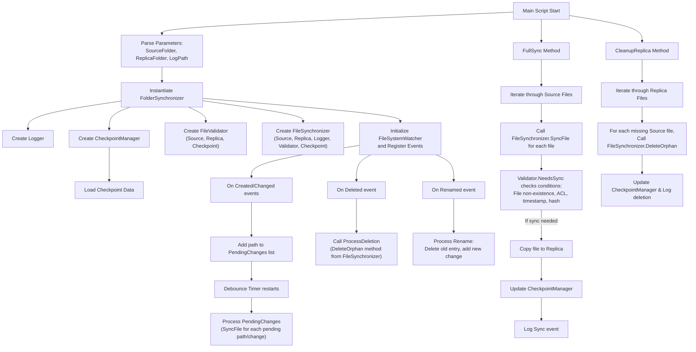

```mermaid
graph TD
    A["Main Script Start"]
    B["Parse Parameters:\nSourceFolder, ReplicaFolder, LogPath"]
    A --> B
    B --> C["Instantiate FolderSynchronizer"]
    
    C --> D["Create Logger"]
    C --> E["Create CheckpointManager"]
    E --> F["Load Checkpoint Data"]
    C --> G["Create FileValidator\n(Source, Replica, Checkpoint)"]
    C --> H["Create FileSynchronizer\n(Source, Replica, Logger, Validator, Checkpoint)"]
    C --> I["Initialize FileSystemWatcher\nand Register Events"]
    
    A --> J["FullSync Method"]
    J --> K["Iterate through Source Files"]
    K --> L["Call FileSynchronizer.SyncFile for each file"]
    L --> M["Validator.NeedsSync checks conditions:\nFile non-existence, ACL, timestamp, hash"]
    M -- "If sync needed" --> N["Copy file to Replica"]
    N --> O["Update CheckpointManager"]
    O --> P["Log Sync event"]
    
    A --> Q["CleanupReplica Method"]
    Q --> R["Iterate through Replica Files"]
    R --> S["For each missing Source file,\nCall FileSynchronizer.DeleteOrphan"]
    S --> T["Update CheckpointManager & Log deletion"]
    
    I --> U["On Created/Changed events"]
    U --> V["Add path to PendingChanges list"]
    V --> W["Debounce Timer restarts"]
    W --> X["Process PendingChanges\n(SyncFile for each pending path/change)"]
    
    I --> Y["On Deleted event"]
    Y --> Z["Call ProcessDeletion\n(DeleteOrphan method from FileSynchronizer)"]
    
    I --> AA["On Renamed event"]
    AA --> AB["Process Rename:\nDelete old entry, add new change"]

```