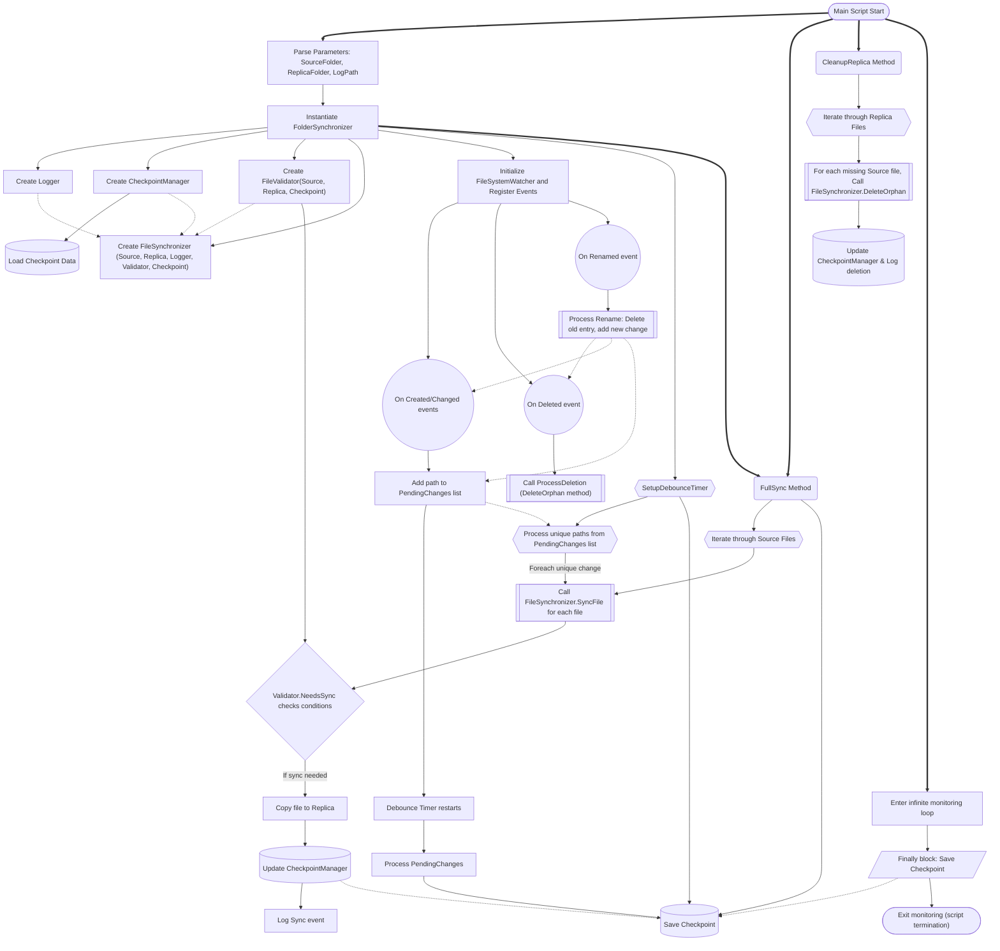

```mermaid
graph TD
    A(["Main Script Start"]) 
    B["Parse Parameters: SourceFolder, ReplicaFolder, LogPath"]
    A ==> B
    B --> C["Instantiate FolderSynchronizer"] 
    %% Class instantiation as rectangle
    C --> D["Create Logger"] 
    C --> E["Create CheckpointManager"] 
    E --> F[("Load Checkpoint Data")] 
    C --> G["Create FileValidator(Source, Replica, Checkpoint)"] 
    C --> H["Create FileSynchronizer (Source, Replica, Logger, Validator, Checkpoint)"] 
    C --> I["Initialize FileSystemWatcher and Register Events"]
    A ==> J("FullSync Method")
    J --> K{{"Iterate through Source Files"}} 
    K --> L[["Call FileSynchronizer.SyncFile for each file"]] 
    L --> M{"Validator.NeedsSync checks conditions"} 
    M --"If sync needed"--> N["Copy file to Replica"] 
    N --> O[("Update CheckpointManager")]
    O --> P["Log Sync event"] 
    J --> AC[("Save Checkpoint")] 
    
    A ==> Q("CleanupReplica Method")
    Q --> R{{"Iterate through Replica Files"}} 
    R --> S[["For each missing Source file, Call FileSynchronizer.DeleteOrphan"]] 
    S --> T[("Update CheckpointManager & Log deletion")] 
    
    I --> U(("On Created/Changed events")) 
    U --> V["Add path to PendingChanges list"] 
    V --> W["Debounce Timer restarts"] 
    W --> X["Process PendingChanges"]
    X --> AC
    I --> Y(("On Deleted event"))  
    Y --> Z[["Call ProcessDeletion (DeleteOrphan method)"]] 
    
    I --> AA(("On Renamed event"))  
    AA --> AB[["Process Rename: Delete old entry, add new change"]] 
    
    C --> CA{{"SetupDebounceTimer"}}  
    A ==> AE["Enter infinite monitoring loop"]  
    AE --> AD[/"Finally block: Save Checkpoint"/]  
    AD -.-> AC
    AD --> AF(["Exit monitoring (script termination)"])  
    
    CA --> VA{{"Process unique paths from PendingChanges list"}} 
    VA --"Foreach unique change"--> L
    CA --> AC
    
    O -.- AC
    G -.-> H
    G --> M
    E -.-> H
    D -.-> H
    AB -.-> Y
    AB -.-> U
    AB -.-> V
    C ==> J
    V -.-> VA
```
